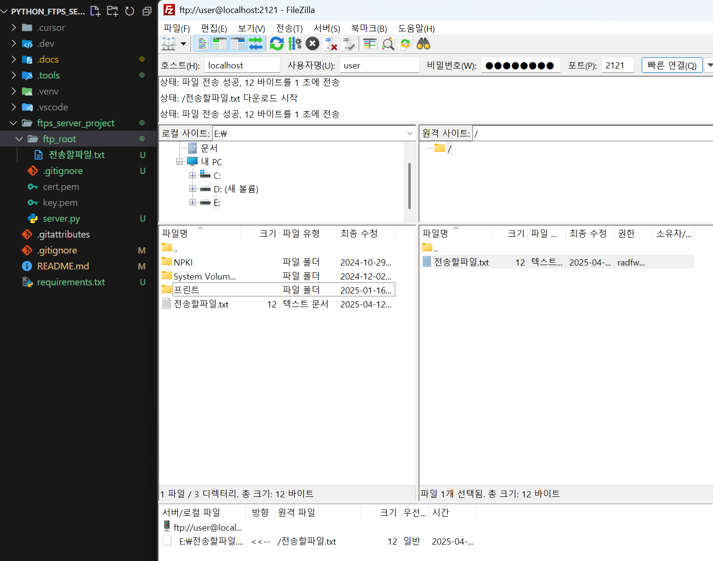

# python_ftps_server

ftps 파일 전송 서버 \_40분만에 만드는

## 🛠️ FTPS 서버 구축 프로젝트 진행 상황

### 🔰 1단계: 로컬 FTPS 서버 구축 (테스트 완료)

| 항목                                                | 상태    |
| --------------------------------------------------- | ------- |
| 📁 프로젝트 디렉토리 구성 (`ftp_root`, `server.py`) | ✅ 완료 |
| 🔐 self-signed 인증서 (`cert.pem`, `key.pem`) 생성  | ✅ 완료 |
| 🧰 pyftpdlib 설치 + `[ssl]` 옵션 포함               | ✅ 완료 |
| 🧾 Python 코드 작성 (명시적 FTPS)                   | ✅ 완료 |
| 🚀 서버 실행 확인 (`python server.py`)              | ✅ 완료 |
| 🧪 클라이언트 연결 테스트 (curl로 FTPS 접속 성공)   | ✅ 완료 |
| 🧪 파일 조회/전송 테스트 (`LIST`, 파일 확인됨)      | ✅ 완료 |

> ✅ **1단계 로컬 테스트는 완벽하게 마무리됐습니다.** 🎉

### 📸 FTPS 서버 테스트 화면

_FTPS 서버가 정상적으로 실행되고 있는 모습입니다._

---

### 🌐 2단계: 외부 접근 설정 (**진행 전**)

| 항목                                           | 상태    |
| ---------------------------------------------- | ------- |
| 📡 공유기 포트포워딩 설정 (2121 + 60000~60009) | ⏳ 예정 |
| 🔥 Windows 방화벽 인바운드 규칙 설정           | ⏳ 예정 |
| 🌍 외부 디바이스에서 접속 테스트 (공인 IP)     | ⏳ 예정 |

---

### 🔧 3단계: 기능 확장 (**선택 사항**)

| 기능 항목                                         | 상태    |
| ------------------------------------------------- | ------- |
| 🧑‍💻 사용자별 권한/제한 (읽기 전용, 업로드 전용 등) | ⏳ 예정 |
| ⛔ 업로드 확장자 제한 (.exe, .zip 등)             | ⏳ 예정 |
| 📝 업로드/다운로드 로그 기록                      | ⏳ 예정 |
| 📊 관리자 대시보드 (FastAPI + React 등)           | ⏳ 예정 |
| 🐳 Docker 배포 자동화                             | ⏳ 예정 |

---

## 라이센스

이 프로젝트는 MIT 라이센스를 따릅니다. 자세한 내용은 [LICENSE](LICENSE) 파일을 참조하세요.

